# Renderer 3D

## Introduction
The project consists of an animated 3D scene created
in C++ using OpenGL. It contains several interactive settings
allowing users to change the feel and details of the presented scene,
such as toggleable normal mapping and implementation of
two different lighting models.

## Installation and Compilation

The project has been tested on a Windows 10 device using C++20 and compiled using CMake.

### Prerequisites

Ensure you have the following dependencies installed:
- CMake
- A C++20-compatible compiler
- OpenGL development libraries
- GLFW3
- Assimp
- Zlib

### Cloning the Repository

Start by cloning the repository:
```sh
git clone https://github.com/kubapoke/renderer-3D
cd renderer-3D
```

### Building the Project

1. **Create a build directory:**
   ```shell
   mkdir build
   cd build
   ```

2. **Generate build files with CMake:**
   ```shell
   cmake ..
   ```
   This ensures that the project is compiled using C++20.

3. **Compile the project:**
   ```shell
   cmake --build .
   ```

### Running the Application

Once the build process is complete, you can run the application by executing:
```shell
./Renderer3D
```

## Usage
After launching the application, you will be presented with a 3D scene,
which consists of several objects:
* A plane representing the ground.
* A big, golden sphere in the middle of the scene.
* A cube, close to the sphere.
* A spaceship orbiting the cube whilst slowly moving up and down.

The scene is lit up by several lights:
* A directional light representing the sun.
* Two point lights, denoted by the white spheres.
* A spotlight on the spaceship.

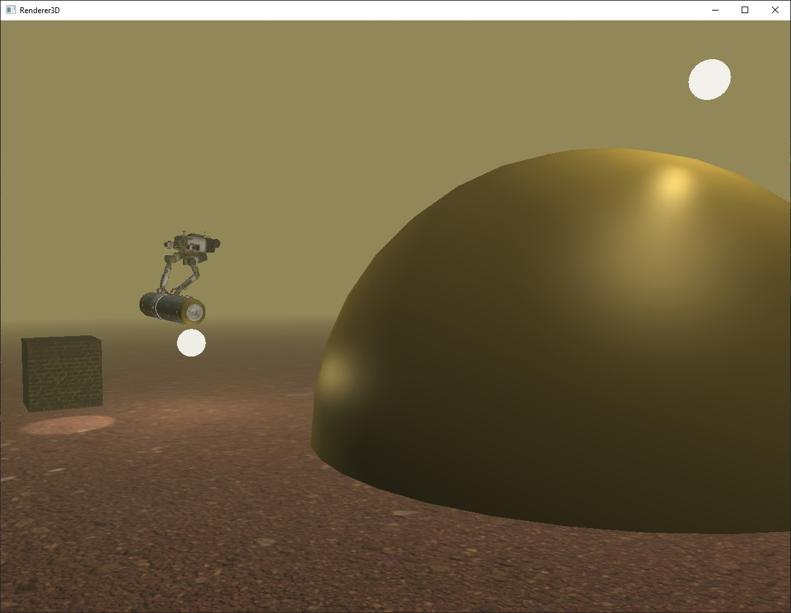

### Controls
Several elements of the scene are interactive, for a more concise look
at the controls refer to the [README.md](./Renderer3D/README.md) file
inside the project directory. This section will contain a more 
detailed look on what each of them does.

#### Camera
By default, you are put in a free camera mode. You control it by using
mouse movement to look around and ```WASD``` buttons to move, as well
as your mouse scroll to zoom in. There also 3 built-in fixed camera
modes that you can enter by pressing one of the following number buttons:
* ```1``` - A stationary camera observing the scene.
* ```2``` - A stationary camera observing the spaceship.
* ```3``` - A camera fixed to the spaceship, following it from behind.

Whenever in a fixed camera mode you can press ```0``` to
return to the free camera mode.

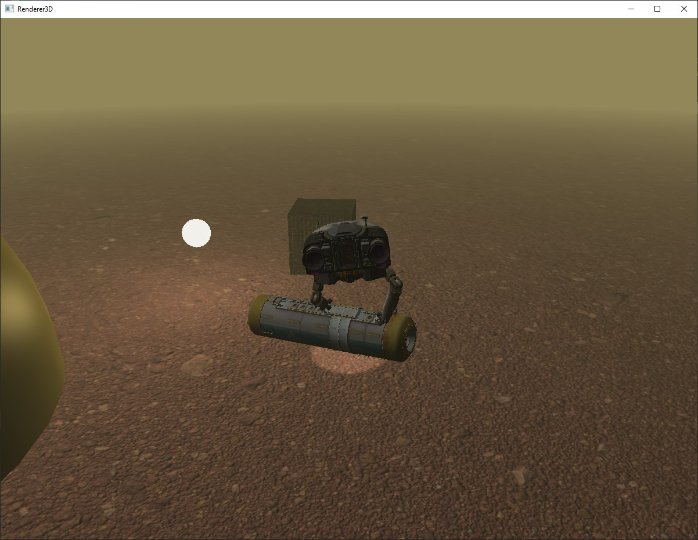

#### Time of day

```Z```/```X``` buttons toggle the scene between day and night mode respectively,
by modifying the values of light produced by the directional light.

|                            Day                            |                             Night                             |
|:---------------------------------------------------------:|:-------------------------------------------------------------:|
| 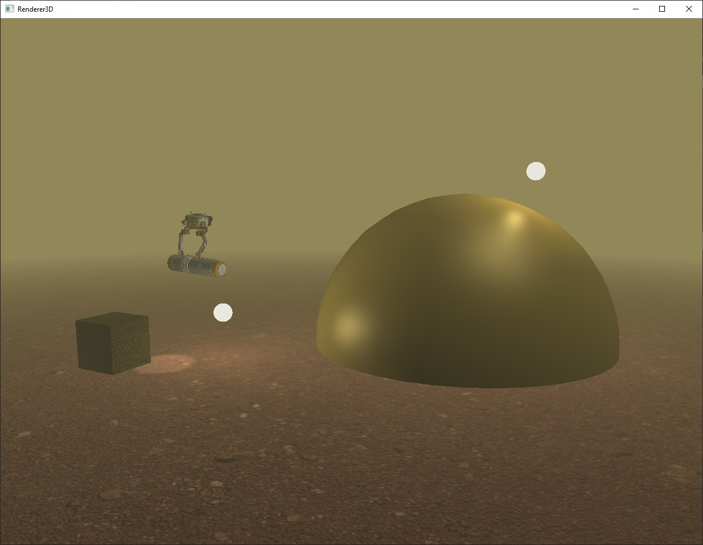 | 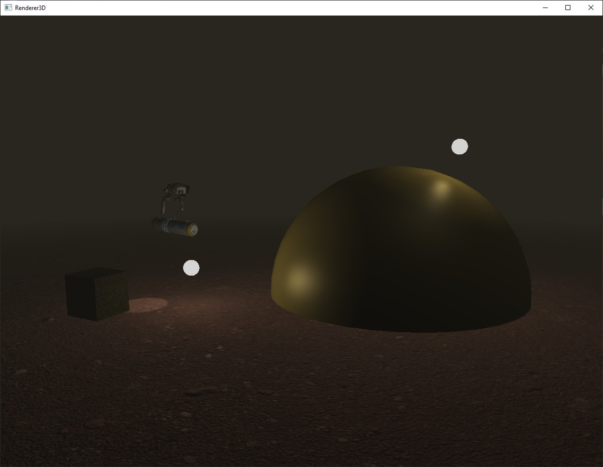 |

#### Fog

```C```/```V``` buttons decrease/increase (gradually) the amount of fog present
respectively.

|                          Low fog level                           |                           High fog level                           |
|:----------------------------------------------------------------:|:------------------------------------------------------------------:|
| 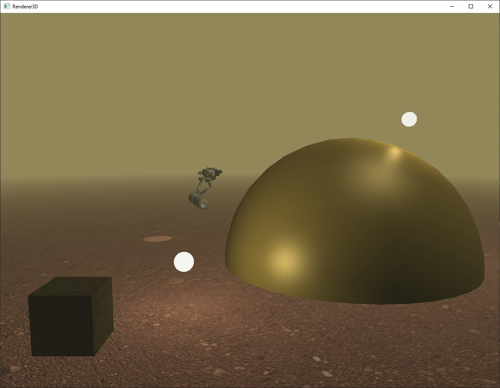 | 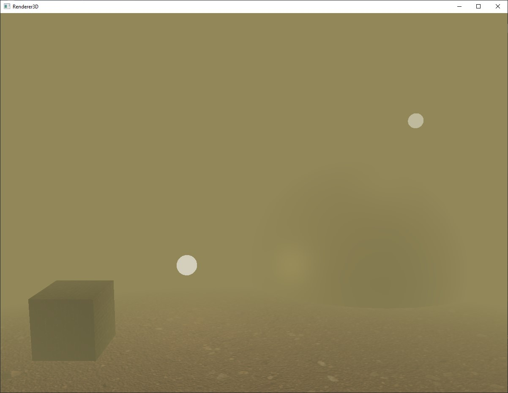 |

#### Specular shading calculations

```B```/```N``` buttons swap the calculation of specular component of lighting
between the Blinn and Phong models.

|                          Blinn lighting model                          |                          Phong lighting model                          |
|:----------------------------------------------------------------------:|:----------------------------------------------------------------------:|
| 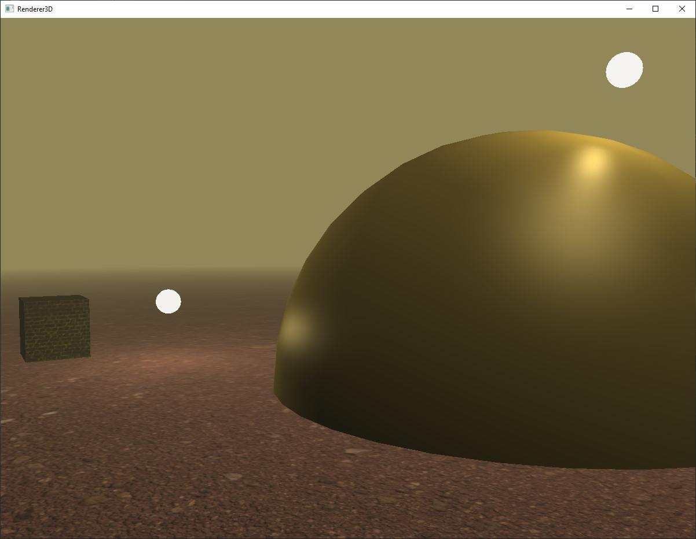 | 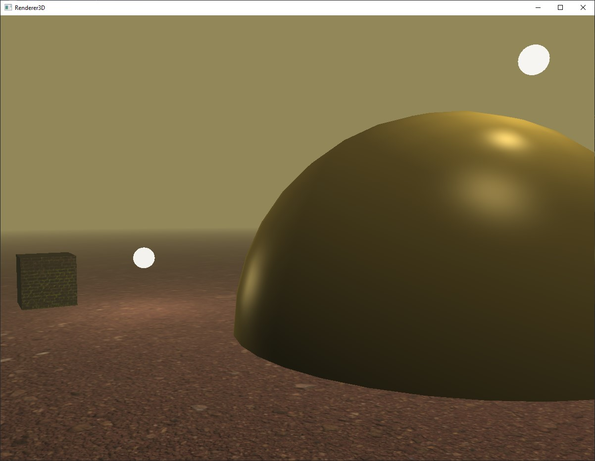 |

#### Normal mapping

```F```/```G``` buttons toggle normal mapping on/off respectively.

|                               Normal mapping on                               |                               Normal mapping off                                |
|:-----------------------------------------------------------------------------:|:-------------------------------------------------------------------------------:|
| 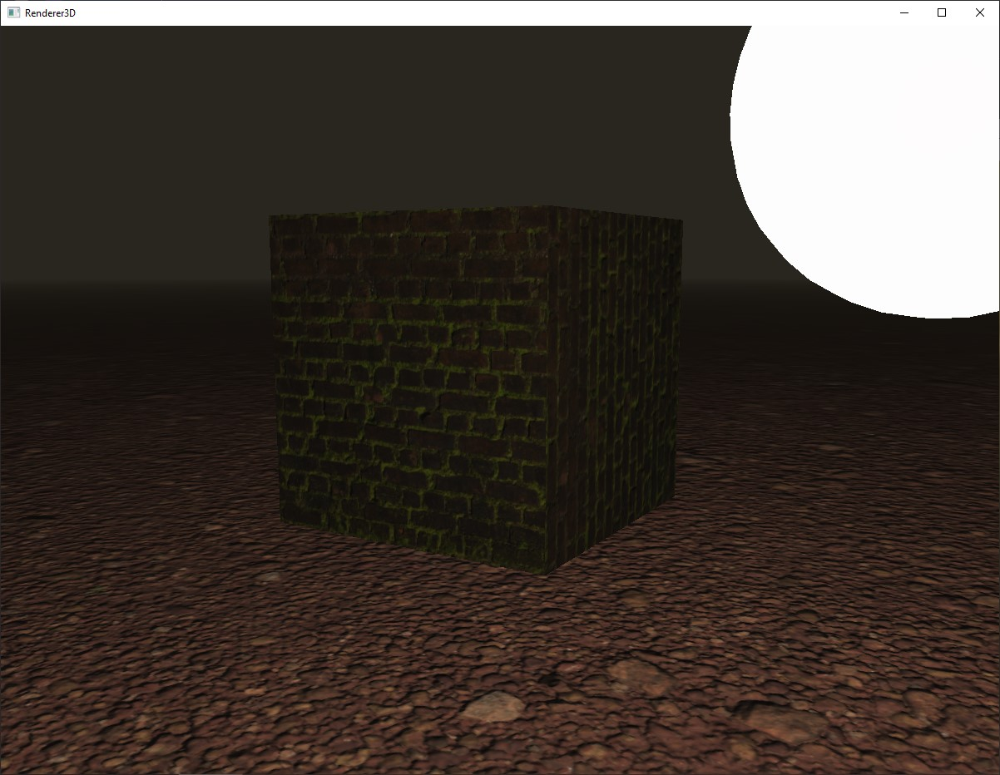 | 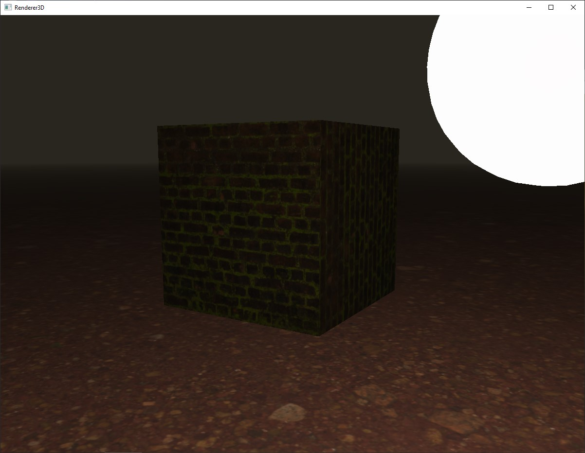 |

#### Spotlight controls

The arrow buttons (```UP```, ```DOWN```, ```LEFT```, ```RIGHT```) change the relative 
position of the spaceship's spotlight.

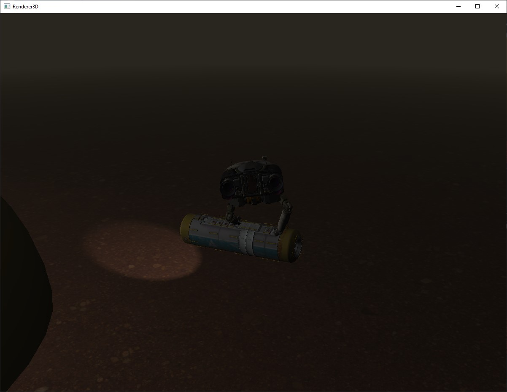

#### Exiting the application

Whenever you wish to quit the application, press the ```ESC``` button.